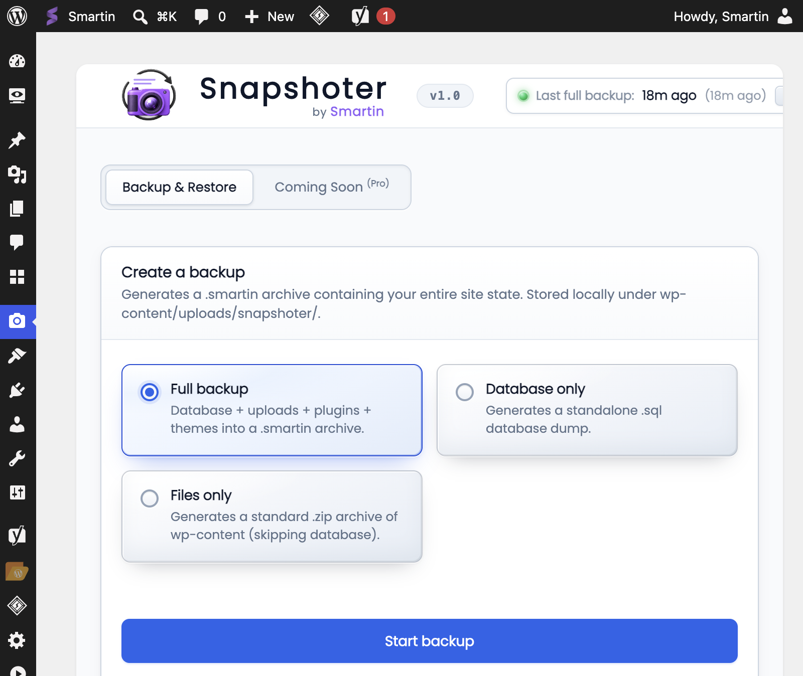
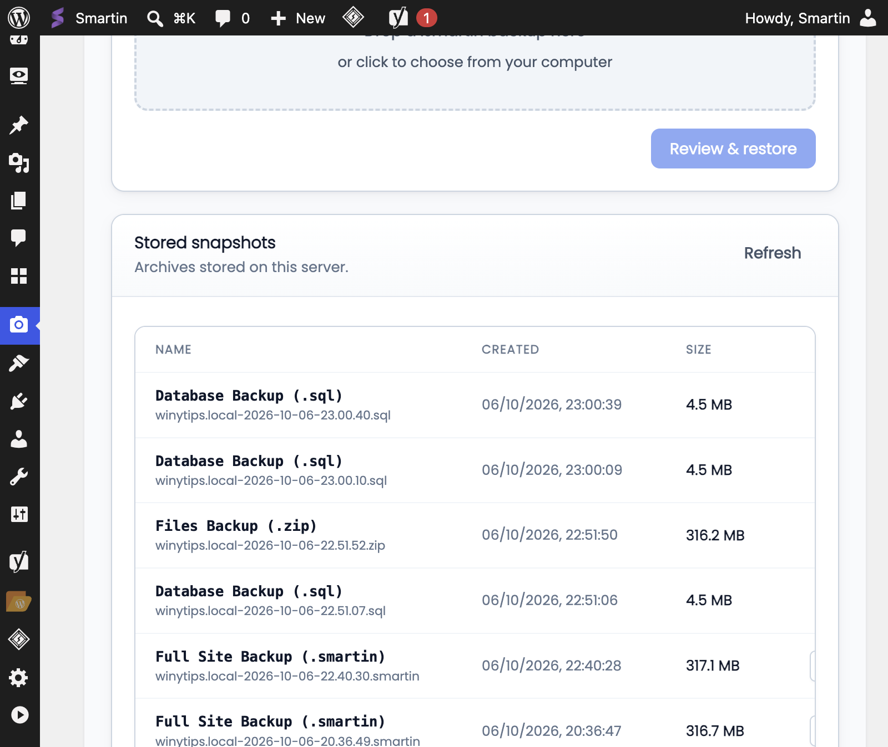
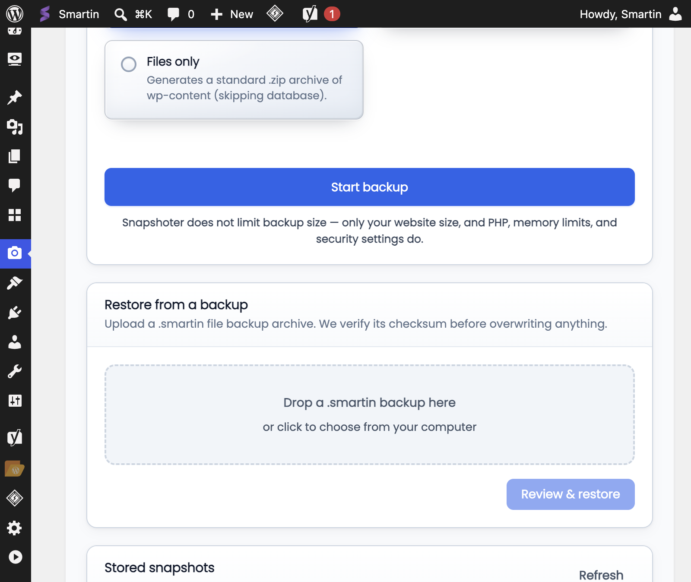

# Snapshoter: WordPress Backup and Migration (Free)

Free WordPress backup and restore. Your site (database + files) goes into one `.smartin` archive: keep it on the server, move hosts, or work locally and restore when ready.

Works with Elementor, Divi, WooCommerce, and typical shared hosting. Restore updates URLs when the domain changes. Limits are your host's memory, time, and disk, not a plugin quota.

| | |
| --- | --- |
| **WordPress** | 6.0 or newer |
| **PHP** | 7.4 or newer (8.0 to 8.3 is fine) |
| **Site type** | Single-site only (not Multisite) |
| **Server** | Apache, Nginx, or LiteSpeed with MySQL or MariaDB |
| **Platforms** | Normal Linux hosts, Local, and similar. Windows IIS if WordPress already runs there |

  

---

## How to use Snapshoter Free

### 1. Install

1. Install from a zip, or copy the `snapshoter` folder into `wp-content/plugins/`.
2. Activate under **Plugins**.
3. Open **Snapshoter** in the admin menu.

You get the **Backup & Restore** screen: create backups, restore, and list files on the server.

### 2. Create a backup

Pick one:

- **Full backup**: database, uploads, plugins, and themes in a `.smartin` file (best for migration)
- **Database only**: `.sql` file
- **Files only**: `.zip` of `wp-content` (no database)

Leave **Full backup** selected and click **Start backup**.

1. The archive is built in chunks so small hosts can finish.
2. The file is saved under `wp-content/uploads/snapshoter/` (or a custom path if you set one in `wp-config.php`).
3. It shows up under **Stored snapshots**.

If a backup fails, check PHP memory, `max_execution_time`, free disk space, or security plugins that block long admin requests.

Do a full backup before big updates or a host move. Use database-only for content-only rollbacks.

### 3. Stored snapshots

**Stored snapshots** lists name, date, and size for each archive on this server.

- Check the size looks normal (not a few KB).
- Download a copy before you restore or wipe the server.
- `.smartin` = full site, `.sql` = database, `.zip` = files.

Click **Refresh** if the list is outdated. Keep a copy off this server too.

### 4. Restore or migrate

On the site you want to restore into:

1. Activate Snapshoter Free.
2. Under **Restore from a backup**, drop a `.smartin` file (or choose one).
3. Click **Review & restore** and confirm.

The plugin checks the file before it overwrites anything. On a new domain it updates URLs in the database.

Stay on this screen until it finishes. Do not open the site front end during restore.

When it is done, log in again if asked, check a few pages and the media library, and clear any page or CDN cache.

### 5. Move to another domain

1. On the old site: full backup, then download the `.smartin`.
2. On the new host: install WordPress and Snapshoter Free.
3. Upload the `.smartin` and run **Review & restore**.
4. If links look wrong: **Settings → Permalinks → Save**.

You usually do not need a separate search-replace plugin.

---

## Common problems

| Problem | Likely cause |
| --- | --- |
| Backup stops halfway | Host PHP timeout or low memory |
| Cannot activate on Multisite | Free is single-site only |
| Site shows maintenance after restore | Wait until restore finishes |
| Upload is slow | Large file and host limits; leave the tab open |
| Cannot find the file | Look in `wp-content/uploads/snapshoter/` on the server that made it |

---

## Privacy

Backups are stored on your server. A `.smartin` file contains a complete copy of your site and may include personal or sensitive data. Treat it like any other database or full-site backup and store it securely.

---

## Source

https://github.com/smartinjos/snapshoter-wordpress-backup

## License

GPL v2 or later. See [license.txt](license.txt).
